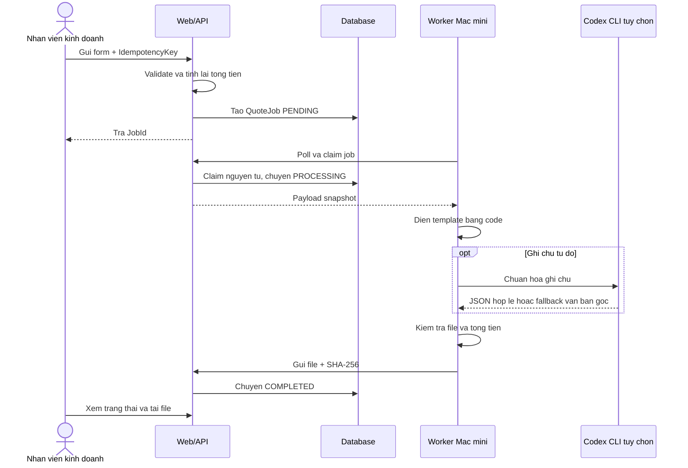
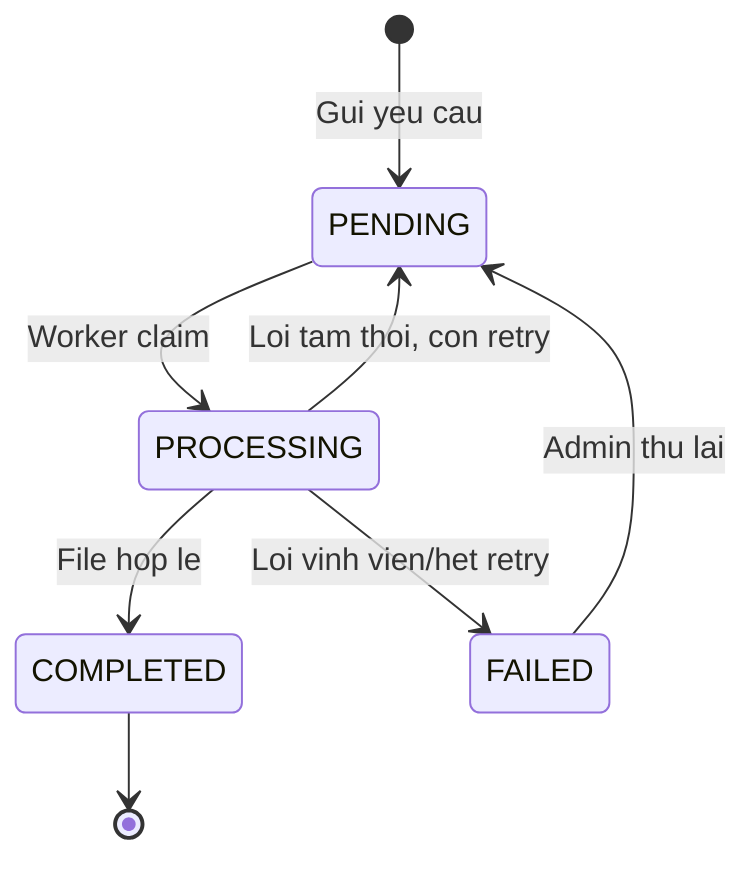

# Solution Plan: Tu dong hoa tao bao gia

## Muc tieu

Prototype SME cho quy trinh: nhan vien chon khach hang, nhap thong tin san pham va gui yeu cau; Web API tao `QuoteJob`; Worker tren Mac mini lay job, dien template va tra ve file bao gia.

## 1. Phan vai AI va code xac dinh

Nguyen tac: **AI de xuat, code quyet dinh**.

| Cong viec | Cong cu | Ly do |
|---|---|---|
| Validate form, sinh so bao gia | Code xac dinh | Quy tac ro rang, test duoc |
| Tinh thanh tien, VAT, tong tien | Code voi `decimal` | Tranh sai so tien |
| Copy template va dien placeholder/o | Code (`ClosedXML`, `python-docx` hoac `docxtemplater`) | Lap lai, on dinh, khong ton token |
| Kiem tra file, doi chieu tong tien | Code | Co the tu dong pass/fail |
| Chuan hoa ghi chu tu do | Codex CLI/LLM tuy chon | Phu hop bai toan ngon ngu |
| De xuat mapping khi template thay doi | Codex CLI o giai doan dev | Tao patch de nguoi review, khong tu chay production |

Neu AI trong runtime loi hoac timeout, giu nguyen van ban goc va tiep tuc job. Output AI phai theo JSON schema, co timeout, duoc xem input la du lieu de tranh prompt injection.

## 2. Data flow va trang thai

`QuoteJob` toi thieu gom: `Id`, `QuoteNo`, `CustomerId`, `PayloadJson`, `IdempotencyKey` unique, `Status`, `Attempt`, `NextAttemptAt`, `LockedUntil`, `ErrorCode`, `ErrorMessage`, `OutputPath`, `OutputSha256`, `CreatedBy` va cac moc thoi gian. Luu snapshot payload de tai tao dung file khi du lieu khach hang thay doi.

Worker pull job thay vi API push vao Mac mini: khong can mo cong Mac mini ra Internet, job van nam trong queue khi may offline; doi lai co do tre theo chu ky poll.

## 3. Reliability va security

- **Idempotency:** unique index tren `IdempotencyKey`; gui lai cung key tra ve job cu. Nut Submit disable chi la UX.
- **Retry:** toi da 3 lan, backoff 1, 5, 15 phut. Loi mang, timeout, file bi khoa la tam thoi; template thieu placeholder hoac payload sai la loi vinh vien.
- **Lease:** `LockedUntil` tu dong tra job ve `PENDING` neu Worker chet giua chung.
- **File:** ghi file tam, kiem tra, sau do doi ten atomic; endpoint ket qua idempotent.
- **Validation:** server khong tin tong tien tu client; gioi han so dong, do dai, so luong > 0, don gia >= 0.
- **Bao mat:** HTTPS, ASP.NET Identity, role Business/Admin, API key rieng cho Worker, secret trong environment, file ngoai `wwwroot`, ten file do server sinh.
- **Formula injection:** gia tri Excel bat dau bang `=`, `+`, `-`, `@` phai ghi nhu chuoi.
- **Audit:** log `JobId`, nguoi tao, nguoi tai va moc thoi gian; khong log du lieu nhay cam.

## 4. Cong nghe

- ASP.NET Core Web API: API va OpenAPI.
- .NET Worker Service: tien trinh poll/claim tren Mac mini.
- SQLite + EF Core: don gian cho prototype SME; co the doi provider sang SQL Server.
- ClosedXML: dien template XLSX va kiem tra de test.
- xUnit: unit test cho tinh tien, idempotency va mapping.
- Interface `ICodexClient` voi `MockCodexClient` cho prototype va `CliCodexClient` khi co Codex CLI that.

## 5. Pham vi prototype

**Lam that:** form/API, validate, QuoteJob, trang thai, worker polling, render theo template tach biet (`templates/quote-template.html`), kiem tra file, idempotency va retry co ban.

**Mock:** CRM, Mac mini (chay Worker local trong API), Codex CLI.

**De sau:** Microservice render PDF tu dong bang Chromium headless, email tu dong, monitoring nang cao, key rotation, backup tu dong va database PostgreSQL/SQL Server.

## 6. Quyet dinh ky thuat ve Template va Dinh dang file dau ra

### Co che Template
Prototype su dung file template HTML tach biet (`templates/quote-template.html`) thay vi hard-code giao dien trong logic nghiep vu:
- Dinh nghia cac placeholder ro rang: `{{QUOTE_NUMBER}}`, `{{CUSTOMER_NAME}}`, `{{CUSTOMER_ID}}`, `{{DELIVERY_TERMS}}`, `{{PAYMENT_TERMS}}`, `{{ITEMS_ROWS}}`, `{{SUBTOTAL}}`, `{{TOTAL}}`.
- Worker doc template tu dia, encode du lieu bang `HtmlEncoder` de phong ngua injection, format tien te theo `vi-VN` va lap rap du lieu.

### Ly do ky thuat lua chon dinh dang HTML Print-ready thay vi DOCX/XLSX/PDF
1. **Zero External Dependencies & Kha chuyen da nen tang:**
   - Cac thu vien DOCX (OpenXML) hoac XLSX (ClosedXML/EPPlus) va cac engine PDF headless (SkiaSharp, wkhtmltopdf, Puppeteer) thuong phu thuoc binary he dieu hanh va de xung dot phien ban giua Windows, macOS (Mac mini worker) va Linux container.
   - HTML thuần cho phep prototype chay ngay lap tuc tren moi moi truong bang mot lenh `dotnet run` duy nhat ma khong can bat ky external dependency nao.
2. **Xem truoc tuc thi va ho tro xuat PDF vector chuan A4:**
   - File HTML mo duoc tren moi trinh duyet, nhung truc tiep vao web dashboard khong can phan mem Office hay Adobe.
   - CSS tich hop `@media print` chuan kho giay A4, cho phep nguoi dung nhan `Ctrl + P` (hoac `Cmd + P`) de luu ngay thanh file **PDF vector chat luong cao**, giu nguyen 100% typography va bo nhan dien thuong hieu An Binh Chemtech.
3. **An toan bao mat (Anti-Injection):**
   - Loai tru triet de rui ro **Formula Injection** khi xuat XLSX (khi nguoi dung nhap ky tu dau `=`, `+`, `-`, `@`).
   - Loai tru rui ro macro doc hai trong DOCX. Du lieu duoc sanitize va encode an toan qua `HtmlEncoder`.
4. **Tach biet giao dien (Separation of Concerns):**
   - Cho phep doi ngu kinh doanh/thiet ke chinh sua bo nhan dien, mau sac, dieu khoan trong file template ma khong can recompile backend.
5. **Kien truc san sang cho Production:**
   - Khi len production, he thong chi can bo sung microservice renderer (Gotenberg hoac Chromium headless) de tu dong convert template HTML sang PDF co ky so e-Invoice.

